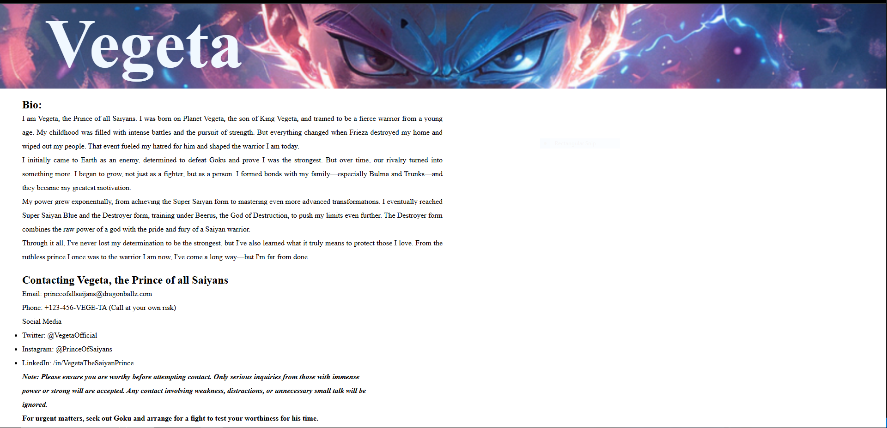

# Vegeta React App

---

## Mockups



---

## Overview
This is a React-based profile page dedicated to Vegeta, the Prince of all Saiyans. The app showcases his biography, contact details, and an engaging header featuring his transformations.

---

## Features
- **About Section:** A detailed biography of Vegeta's journey from a Saiyan prince to a warrior of immense power.
- **Contact Section:** How to (theoretically) get in touch with Vegeta, including email, phone, and social media.
- **Header:** A dynamic visual representation of Vegeta’s character using an image background.
- **Responsive Design:** Styled using CSS for a sleek and engaging user experience.

---

## Component Breakdown

**App.jsx**
- Renders the Header, About, and Contact components.
- Wraps all sections within a ```<section>``` container.

**About.jsx**
- Displays Vegeta's biography in a structured format.
- Highlights his evolution as a warrior.

**Contact.jsx**
- Provides contact details in a fun, thematic way.
- Includes humorous disclaimers about contacting Vegeta.

**Header**
- Displays Vegeta's name with a styled background image.
- Uses CSS to enhance visual appeal.

**Styles.css**
- Handles layout and styling for all components.
- Includes a custom background image for the header.

---

## Technologies Used

- **React.js**
- **Vite**
- **CSS**

---

## Folder Structure
```plaintext

Project Root
│── public/
│   ├── vegetaimage.webp
│── src/
│   ├── About.jsx
│   ├── App.jsx
│   ├── Contact.jsx
│   ├── Header.jsx
│   ├── main.jsx
│   ├── Styles.css
│── .gitignore/
│── eslint.config.js
│── index.html
│── package-lock.json
│── package.json
│── README.md
│── vite.config.js
```